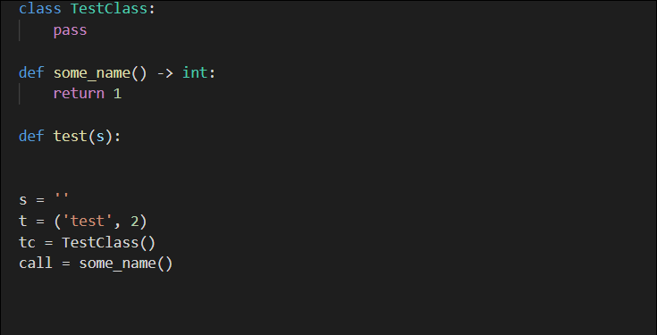

# Python Type Hint

Provides type hint auto-completion for Python.

## Features

* Estimates the correct type to provide as a completion item.

* Searches Python files in the workspace for type estimation purposes.

* Can provide completion items for the typing module if it is imported.

## Installation

Get this extension from the [Visual Studio Marketplace](https://marketplace.visualstudio.com/items?itemName=).

## Known Issues

* The difference between function and class constructor calls when detecting types is determined by the first letter being upper case (unless the class or function is defined in the currently edited document).

* Up to 20 files within in the workspace are searched at a time. The limit is by design to keep the extension light weight, but there's probably a better solution.

-------------------------------------------------------------------------------------------
